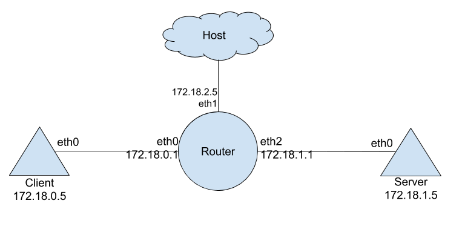
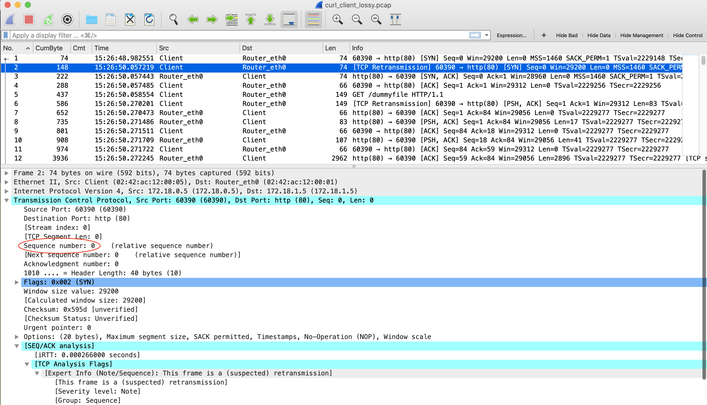
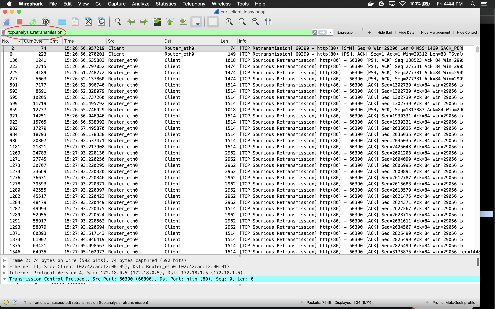
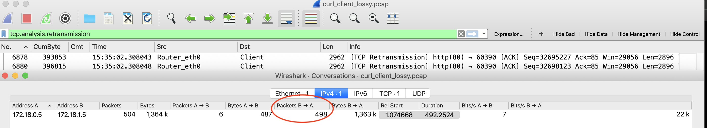
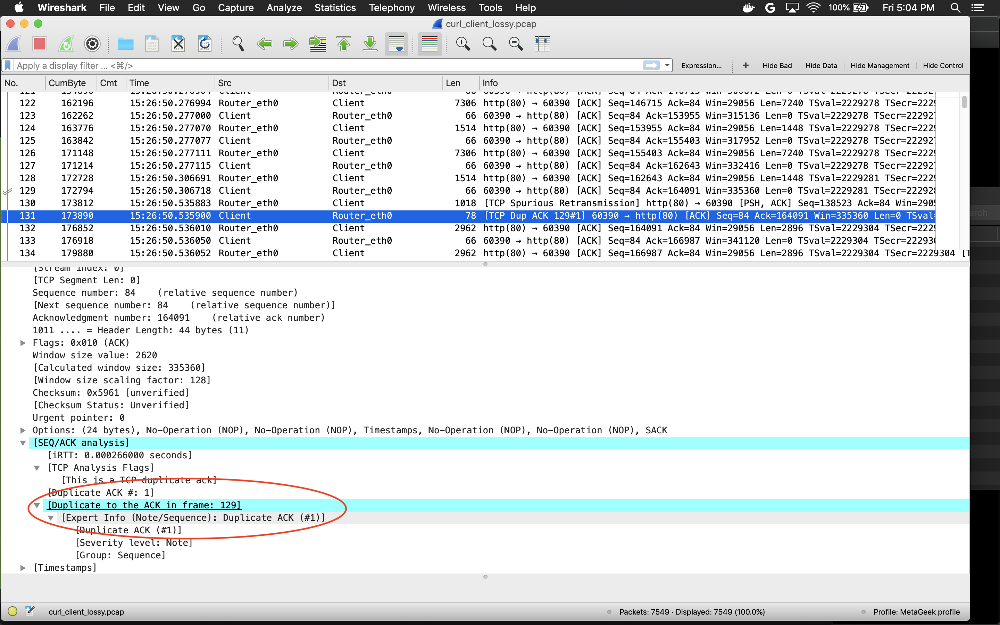
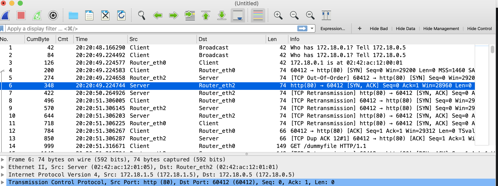

The purpose of this is to emulate a simple client <==> server model with a router inbetween. Different network impairments will be applied to show examples of analyzing various network failure scenarios.

While the Router is simply a Linux container routing between two other containers ("client" and "server") the concepts apply to Access Points as well; or any network element responsible for carrying traffic between two hosts.
The main impairments we'll be analyzing are:
* Deley
* Packet Loss
* QoS Buffer overflow (coming soon!)

# Requirements
* docker

# Quickstart
* git clone this repo
* docker-compose up
* [in 3 terminals] docker attach client|server|router

# Topology


# Scenario 1 [ICMP Network Delay]
This example will apply delay at the routers outgoing interface towards the server.
In the real world this could happen for any number of reasons, including link capacity, AP/Router CPU, software-bug etc.

On the router container lets introduce 250ms of delay on the interface headed towards the Server:
```
tc qdisc add dev eth2 root netem delay 250ms
```
## Verify it's broken
Ping the Server **from the Client**
```
root@33a60d9be0a7:/home/simpleclient# ping 172.18.1.5
PING 172.18.1.5 (172.18.1.5) 56(84) bytes of data.
64 bytes from 172.18.1.5: icmp_seq=2 ttl=63 **time=252 ms**
64 bytes from 172.18.1.5: icmp_seq=2 ttl=63 **time=251 ms**
64 bytes from 172.18.1.5: icmp_seq=3 ttl=63 **time=251 ms**
64 bytes from 172.18.1.5: icmp_seq=4 ttl=63 **time=250 ms**
```
## Analyze the PCAP
When looking at packet captures, choosing the location (or device) is critical. Here we'll run TCPDUMP on the Routers interfaces to isolate where they delay is occuring.

First, on the interface headed towards the client:
```
root@d9fbc3167c1e:/home/router# tcpdump -n -i eth0
tcpdump: verbose output suppressed, use -v or -vv for full protocol decode
listening on eth0, link-type EN10MB (Ethernet), capture size 262144 bytes
15:40:23.161935 IP 172.18.0.5 > 172.18.1.5: ICMP echo request, id 22, seq 1, length 64
15:40:23.412485 IP 172.18.1.5 > 172.18.0.5: ICMP echo reply, id 22, seq 1, length 64
```
You can subtract the timestamps to see the same amount of latency being reported by the ping command. Eg; 23.412485 - 23.161935 = 0.25055 (~250ms). Alternatively, you can also print the timestamps as a delta from previously captured packet (no need for the math). For example
```
root@d9fbc3167c1e:/home/router# tcpdump -n -i eth0 -ttt
tcpdump: verbose output suppressed, use -v or -vv for full protocol decode
listening on eth0, link-type EN10MB (Ethernet), capture size 262144 bytes
 00:00:00.000000 IP 172.18.0.5 > 172.18.1.5: ICMP echo request, id 29, seq 1, length 64
 **00:00:00.250685** IP 172.18.1.5 > 172.18.0.5: ICMP echo reply, id 29, seq 1, length 64
 00:00:00.750663 IP 172.18.0.5 > 172.18.1.5: ICMP echo request, id 29, seq 2, length 64
 **00:00:00.250717** IP 172.18.1.5 > 172.18.0.5: ICMP echo reply, id 29, seq 2, length 64
 00:00:00.750206 IP 172.18.0.5 > 172.18.1.5: ICMP echo request, id 29, seq 3, length 64
 **00:00:00.250473** IP 172.18.1.5 > 172.18.0.5: ICMP echo reply, id 29, seq 3, length 64
 ```

That just shows us what we already knew; so lets try to isolate it further. Since the delay is apparent on the interface heading towards the client, lets look at the next step upstream, the interface headed towards the server
```
root@d9fbc3167c1e:/home/router# tcpdump -n -i eth2 -ttt
tcpdump: verbose output suppressed, use -v or -vv for full protocol decode
listening on eth2, link-type EN10MB (Ethernet), capture size 262144 bytes
 00:00:00.000000 IP 172.18.0.5 > 172.18.1.5: ICMP echo request, id 30, seq 1, length 64
 **00:00:00.000247** IP 172.18.1.5 > 172.18.0.5: ICMP echo reply, id 30, seq 1, length 64
 00:00:01.003734 IP 172.18.0.5 > 172.18.1.5: ICMP echo request, id 30, seq 2, length 64
 **00:00:00.000207** IP 172.18.1.5 > 172.18.0.5: ICMP echo reply, id 30, seq 2, length 64
 00:00:00.999918 IP 172.18.0.5 > 172.18.1.5: ICMP echo request, id 30, seq 3, length 64
 **00:00:00.000394** IP 172.18.1.5 > 172.18.0.5: ICMP echo reply, id 30, seq 3, length 64
```
Looking at the timestamps, the delay is NOT apparent here. This points at the delay occurring somewhere between the incoming interface FROM the Client and the outgoing interface TO the Server; eg Router induced delay.

But what if we didn't know which direction the delay was being incurred on? Since Ping reports the RTT, let's single out whether the delay is occurring in the upstream or downstream. Perhaps you don't have access to the router, or intermediate network element, but you do have access to the Client and Server. Or maybe you have access to the Client, Server and first-hop router (or Access Point), but do not have access to the next upstream router. For this example, we'll capture on both the Client and Server and take a closer look at the two pcaps to identify where the direction of the incurred delay.
```
$docker ps -f name=client
CONTAINER ID        IMAGE               COMMAND                   CREATED             STATUS              PORTS               NAMES
**33a60d9be0a7**        mike909/client:v1   "/bin/sh -c '\"/home/…"   3 hours ago         Up 3 hours                              client
$docker exec -it 33a60d9be0a7 bash
root@33a60d9be0a7:/home/simpleclient# tcpdump -n -i eth0 -w /mnt/hostdir/client_pings_delayed.pcap
# And on the Server:
root@3c2c5b896825:/home/server# tcpdump -n -i eth0 -w /mnt/hostdir/server_pings_delayed.pcap
tcpdump: listening on eth0, link-type EN10MB (Ethernet), capture size 262144 bytes

root@33a60d9be0a7:/home/simpleclient# ping 172.18.1.5 -c3
```
Now, in our hosts directory we have the two pcaps; one from Client and other from Server. In this contrived example we can simply open them both in Wireshark and analyze separately; however in a more complex situation, it may be beneficial to combone both pcaps into a single file, and analyze together. Open one pcap, then File-->Merge and select the other.
Note, Wireshark won't be able to 'follow' the ICMP Echo/Reply conversation from the Client, however you can use the Sequence numbers yourself to follow it. For example:

and the corrosponding reply in packet 4...


Note, I've changed the preferences to show Source and Dest as MAC instead of IP here to make it easier to read (Preferences-->Columns). I've also modified the address resolution to rename the MACs to Client, Server and Router instead of the actual MAC address. Do this in View-->Name Resolution-->Edit Resolved Name; or populate a file named 'ethers' in your config directory (see Help-->About Wireshark-->Folders). For example, my ethers file:
```
02:42:ac:12:00:05 Client
02:42:ac:12:00:01 Router_eth0
02:42:ac:12:01:01 Router_eth2
02:42:ac:12:01:05 Server
```
Now we can deduce that the 250ms delay in RTT (pings) is occurring in the upstream direction since the time delta between the Echo Reply FROM the Server and receiving it at the Client is minimal as compared to the Echo Request FROM the Client being received by the Server. For example:
From Client TO Server:

From Server TO Client:

We can also determine that it's not the Server introducing processing delay, by looking at the delta between the Server receiving the Echo Request and sending the Echo Reply. This would be visible in tcpdump as well:
```
root@3c2c5b896825:/home/server# tcpdump -n -i eth0 -ttt
tcpdump: verbose output suppressed, use -v or -vv for full protocol decode
listening on eth0, link-type EN10MB (Ethernet), capture size 262144 bytes
 00:00:00.000000 IP 172.18.0.5 > 172.18.1.5: ICMP echo request, id 16, seq 3418, length 64
 00:00:00.000079 IP 172.18.1.5 > 172.18.0.5: ICMP echo reply, id 16, seq 3418, length 64
 ```
Also worth pointing out other tools which can help find the problem without capturing packets, for example traceroute and mtr.
```
root@74ea77a5ea2d:/home/simpleclient# mtr 172.18.1.5 -n -c 5 -r
Start: 2019-04-18T21:44:19+0000
HOST: 74ea77a5ea2d                Loss%   Snt   Last   Avg  Best  Wrst StDev
  1.|-- 172.18.0.1                 0.0%     5    0.2   0.2   0.2   0.2   0.0
  2.|-- 172.18.1.5                 0.0%     5  251.7 252.4 250.8 254.4   1.4
```
You can clearly see the latency being introduced at some point after the first hop. Likewise, a traceroute shows similar results:
```
root@6e3f5560202e:/home/simpleclient# traceroute 172.18.1.5 -n
traceroute to 172.18.1.5 (172.18.1.5), 30 hops max, 60 byte packets
 1  172.18.0.1  1.365 ms  1.211 ms  1.160 ms
 2  172.18.1.5  251.492 ms  251.416 ms  251.376 ms
 ```
Note, this is with the delay being introduced on the eth2 interface.
## Downstream Network Delay
We can mimic the same thing in the downstream direction by changing our tc command, for example:
```
tc qdisc add dev eth0 root netem delay 250ms
```
Note, you'll actually see 500ms of delay here, since it's cumulative (we are still delaying packets egressing eth2). You can remove the delay with the following:
```
tc qdisc del dev eth2 root netem
```

## Finding the root

If this router was an AP, the Delay could be due to contention/congestion, or excessive 802.11 retries; in either direction. Here we're doing the pcap on the Client interface, so no 802.11 (where you'd see something like excessive 802.11 retries quite clearly). For that you'd need an over-the-air packet capture. More on that later.

# Scenario 2 [TCP Network Delay]
Lets analyze an HTTP download from a few different POV's. First, start a simple webserver **on the Server container:**
```
python -m SimpleHTTPServer 80
```
**On the router**, let's bring back our delay; set to 200ms
```
tc qdisc add dev eth2 root netem rate 1gbit delay 200ms
```
## Looking only at the Client pcap
This assumes we **ONLY** have access to the client-side wired pcap.
Start the pcap **on the Client**
```
docker exec -it client bash
tcpdump -n -i eth0 -w /mnt/hostdir/pcaps/client_curl_delayed.pcap
```
Use Curl to download a 100MB file from the server:
```
curl -o /dev/null 172.18.1.5/dummyfile
  % Total    % Received % Xferd  Average Speed   Time    Time     Time  Current
                                 Dload  Upload   Total   Spent    Left  Speed
100  100M  100  100M    0     0  11.1M      0  0:00:08  0:00:08 --:--:-- 14.5M
```
First, we can see the latency between Client and Server, by looking at the delta between the SYN and the SYN-ACK.
This should align closely with the ping results:

Second, we can see the Throughput in a number of ways:
a) Usinig I/O graph (nice for seeing throughput over time). In our case we are getting 92Mb/s at the 3 second mark.

b) look at the "average" Mb/s by either going to Statistics-->capture file properties OR Statistics-->Protocol Heirarchy:

Note the difference here due to this being average, not a 'point in time' as in the IO Graph.

This aligns with the curl output above (Average Dloud=11.1MB/s). We can also see this with iperf3 reesults, betweeen Client and Server:
```
root@000af00da7e1:/home/simpleclient# iperf3 -c 172.18.1.5 -t10
Connecting to host 172.18.1.5, port 5201
[  4] local 172.18.0.5 port 52830 connected to 172.18.1.5 port 5201
[ ID] Interval           Transfer     Bandwidth       Retr  Cwnd
[  4]   0.00-1.00   sec   396 KBytes  3.24 Mbits/sec    0    113 KBytes
[  4]   1.00-2.00   sec  6.26 MBytes  52.3 Mbits/sec    0   2.80 MBytes
[  4]   2.00-3.00   sec  10.2 MBytes  86.1 Mbits/sec    0   6.92 MBytes
[  4]   3.00-4.00   sec  10.0 MBytes  83.9 Mbits/sec    0   6.92 MBytes
[  4]   4.00-5.00   sec  10.0 MBytes  83.6 Mbits/sec    0   6.92 MBytes
[  4]   5.00-6.00   sec  11.2 MBytes  94.7 Mbits/sec    0   6.92 MBytes
[  4]   6.00-7.00   sec  10.8 MBytes  90.3 Mbits/sec    0   6.92 MBytes
[  4]   7.00-8.01   sec  11.1 MBytes  92.7 Mbits/sec    0   6.92 MBytes
[  4]   8.01-9.00   sec  9.78 MBytes  82.3 Mbits/sec    0   6.92 MBytes
[  4]   9.00-10.00  sec  9.98 MBytes  83.8 Mbits/sec    0   6.92 MBytes
- - - - - - - - - - - - - - - - - - - - - - - - -
[ ID] Interval           Transfer     Bandwidth       Retr
[  4]   0.00-10.00  sec  89.8 MBytes  75.3 Mbits/sec    0             sender
[  4]   0.00-10.00  sec  87.8 MBytes  73.7 Mbits/sec                  receiver
```
With only one viewpoint (Clients) this doesn't help us identify 'where' the slowdown is occurring. For that, similar to above, we need to capture on the other side as well. Just like above, our analysis depends on which element we're capturing on.
Capturing on the Router, we compare the incoming SYN on eth0 (To Client) to the outgoing SYN on eth2 (To Server). This can be easily done in Wireshark (as seen above) but for the purposes of this example, I'll do a tcpdump on all Router interfaces.
```
root@6f0df20286b0:/home/router# tcpdump -i any -n -ttt
tcpdump: verbose output suppressed, use -v or -vv for full protocol decode
listening on any, link-type LINUX_SLL (Linux cooked), capture size 262144 bytes
 00:00:00.000000 IP 172.18.0.5.60374 > 172.18.1.5.80: Flags [S], seq 3056652434, win 29200, options [mss 1460,sackOK,TS val 1562264 ecr 0,nop,wscale 7], length 0
 00:00:00.200900 IP 172.18.0.5.60374 > 172.18.1.5.80: Flags [S], seq 3056652434, win 29200, options [mss 1460,sackOK,TS val 1562264 ecr 0,nop,wscale 7], length 0
 00:00:00.000290 IP 172.18.1.5.80 > 172.18.0.5.60374: Flags [S.], seq 2839013440, ack 3056652435, win 28960, options [mss 1460,sackOK,TS val 1562284 ecr 1562264,nop,wscale 7], length 0
 00:00:00.000022 IP 172.18.1.5.80 > 172.18.0.5.60374: Flags [S.], seq 2839013440, ack 3056652435, win 28960, options [mss 1460,sackOK,TS val 1562284 ecr 1562264,nop,wscale 7], length 0
```
You can see the 200ms latency on line 2. Line 1 is the reception of the SYN on eth0 and line 2 is the egress of the SYN on eth2.
Going the other way, line 3 you see the SYN-ACK being received on eth2 (from Server) and egressing eth0 (to Client) on line 4 .00022ms later.
Note, you probably won't have the luxury of capturing on all interfaces on a network element; so you would need to combine the pcaps as done in the example above.

## Determining whether it's Server induced latency.
Here again we can simply compare Line 1 (Clients SYN) to the Line 2 (Servers SYN-ACK). You can see the Server responds within .084ms. However the delta between the Servers SYN-ACK (line 2) and the Clients ACK (line 3) shows 200ms of latency.
```
root@682de95eed2a:/home/server# tcpdump -n -i eth0 -ttt
tcpdump: verbose output suppressed, use -v or -vv for full protocol decode
listening on eth0, link-type EN10MB (Ethernet), capture size 262144 bytes
 00:00:00.000000 IP 172.18.0.5.60388 > 172.18.1.5.80: Flags [S], seq 3172441468, win 29200, options [mss 1460,sackOK,TS val 1692829 ecr 0,nop,wscale 7], length 0
 00:00:00.000084 IP 172.18.1.5.80 > 172.18.0.5.60388: Flags [S.], seq 2714386468, ack 3172441469, win 28960, options [mss 1460,sackOK,TS val 1692849 ecr 1692829,nop,wscale 7], length 0
 00:00:00.200604 IP 172.18.0.5.60388 > 172.18.1.5.80: Flags [.], ack 1, win 229, options [nop,nop,TS val 1692849 ecr 1692849], length 0
 00:00:00.000129 IP 172.18.0.5.60388 > 172.18.1.5.80: Flags [P.], seq 1:84, ack 1, win 229, options [nop,nop,TS val 1692849 ecr 1692849], length 83: HTTP: GET /dummyfile HTTP/1.1
```
Now this is again oversimplifying; since it's entirely possible that the connection establishment (SYN/SYN-ACK/ACK) is fast; but the Server is then slow to respond later on in the connection. You can use the TCP Stream Graph (Statistics --> TCP Stream Graphs) to visualize the full conversation, as it relates to both latency and throughput.

# Scenario 3 [ICMP Packet Loss]
First, apply a packet loss of 50% **on the Router** between the Client and Server (either on eth0 or eth2):
```
tc qdisc add dev eth2 root netem loss 50%
```
Again, you may need to delete any previous impairments you applied with:
```
tc qdisc del dev eth2 root netem
```

Packet loss is fairly easy to see in the ping output:
```
root@000af00da7e1:/home/simpleclient# ping 172.18.1.5 -i .1 -c 10
PING 172.18.1.5 (172.18.1.5) 56(84) bytes of data.
64 bytes from 172.18.1.5: icmp_seq=2 ttl=63 time=0.271 ms
64 bytes from 172.18.1.5: icmp_seq=3 ttl=63 time=0.275 ms
64 bytes from 172.18.1.5: icmp_seq=5 ttl=63 time=0.293 ms
64 bytes from 172.18.1.5: icmp_seq=6 ttl=63 time=0.174 ms
64 bytes from 172.18.1.5: icmp_seq=7 ttl=63 time=0.158 ms

--- 172.18.1.5 ping statistics ---
10 packets transmitted, 5 received, 50% packet loss, time 986ms
rtt min/avg/max/mdev = 0.158/0.234/0.293/0.057 ms
```
Our latency is fine, but we're dropping about 50% of the packets somewhere in the network. Let's figure out where.
We'll start closest to the source and move up, using 10 Pings from Client to Server as we did above.
First, we capture on our Router eth0 interface:
```
root@6f0df20286b0:/home/router# tcpdump -n -i eth0 icmp
tcpdump: verbose output suppressed, use -v or -vv for full protocol decode
listening on eth0, link-type EN10MB (Ethernet), capture size 262144 bytes
21:10:10.836276 IP 172.18.0.5 > 172.18.1.5: ICMP echo request, id 75, seq 1, length 64
21:10:10.942747 IP 172.18.0.5 > 172.18.1.5: ICMP echo request, id 75, seq 2, length 64
21:10:10.942846 IP 172.18.1.5 > 172.18.0.5: ICMP echo reply, id 75, seq 2, length 64
21:10:11.056383 IP 172.18.0.5 > 172.18.1.5: ICMP echo request, id 75, seq 3, length 64
21:10:11.056499 IP 172.18.1.5 > 172.18.0.5: ICMP echo reply, id 75, seq 3, length 64
21:10:11.162663 IP 172.18.0.5 > 172.18.1.5: ICMP echo request, id 75, seq 4, length 64
21:10:11.273455 IP 172.18.0.5 > 172.18.1.5: ICMP echo request, id 75, seq 5, length 64
21:10:11.386026 IP 172.18.0.5 > 172.18.1.5: ICMP echo request, id 75, seq 6, length 64
21:10:11.386117 IP 172.18.1.5 > 172.18.0.5: ICMP echo reply, id 75, seq 6, length 64
21:10:11.494597 IP 172.18.0.5 > 172.18.1.5: ICMP echo request, id 75, seq 7, length 64
21:10:11.494688 IP 172.18.1.5 > 172.18.0.5: ICMP echo reply, id 75, seq 7, length 64
21:10:11.605403 IP 172.18.0.5 > 172.18.1.5: ICMP echo request, id 75, seq 8, length 64
21:10:11.605510 IP 172.18.1.5 > 172.18.0.5: ICMP echo reply, id 75, seq 8, length 64
21:10:11.713910 IP 172.18.0.5 > 172.18.1.5: ICMP echo request, id 75, seq 9, length 64
21:10:11.827257 IP 172.18.0.5 > 172.18.1.5: ICMP echo request, id 75, seq 10, length 64
21:10:11.827381 IP 172.18.1.5 > 172.18.0.5: ICMP echo reply, id 75, seq 10, length 64
```
You can use the sequence numbers to see that ALL 10 Ehco Reequest packets make it to the Router, but some of the Echo Reply packets are not seen (headed from Server TO Client). For example seq 1, 4, 5 & 9 are dropped somewhere upstream of Router eth0.

Moving one level up, to Router eth1 (interface headed towards server):
```
root@6f0df20286b0:/home/router# tcpdump -n -i eth2 icmp
tcpdump: verbose output suppressed, use -v or -vv for full protocol decode
listening on eth2, link-type EN10MB (Ethernet), capture size 262144 bytes
21:13:05.106737 IP 172.18.0.5 > 172.18.1.5: ICMP echo request, id 77, seq 3, length 64
21:13:05.106885 IP 172.18.1.5 > 172.18.0.5: ICMP echo reply, id 77, seq 3, length 64
21:13:05.323015 IP 172.18.0.5 > 172.18.1.5: ICMP echo request, id 77, seq 5, length 64
21:13:05.323155 IP 172.18.1.5 > 172.18.0.5: ICMP echo reply, id 77, seq 5, length 64
21:13:05.433024 IP 172.18.0.5 > 172.18.1.5: ICMP echo request, id 77, seq 6, length 64
21:13:05.433185 IP 172.18.1.5 > 172.18.0.5: ICMP echo reply, id 77, seq 6, length 64
21:13:05.543327 IP 172.18.0.5 > 172.18.1.5: ICMP echo request, id 77, seq 7, length 64
21:13:05.543475 IP 172.18.1.5 > 172.18.0.5: ICMP echo reply, id 77, seq 7, length 64
21:13:05.653530 IP 172.18.0.5 > 172.18.1.5: ICMP echo request, id 77, seq 8, length 64
21:13:05.653606 IP 172.18.1.5 > 172.18.0.5: ICMP echo reply, id 77, seq 8, length 64
21:13:05.763267 IP 172.18.0.5 > 172.18.1.5: ICMP echo request, id 77, seq 9, length 64
21:13:05.763361 IP 172.18.1.5 > 172.18.0.5: ICMP echo reply, id 77, seq 9, length 64
```
We see that every request has a corresponding reply. This tells us that some of the requests (eg those with seq 1, 2, 4, 10) are never egressing this interface. Therefore, they are being dropped somewhere between eth0 & eth2; eg the Router.

For reference, the this is the Client output:
```
root@000af00da7e1:/home/simpleclient# ping 172.18.1.5 -i .1 -c 10
PING 172.18.1.5 (172.18.1.5) 56(84) bytes of data.
64 bytes from 172.18.1.5: icmp_seq=3 ttl=63 time=0.299 ms
64 bytes from 172.18.1.5: icmp_seq=5 ttl=63 time=0.283 ms
64 bytes from 172.18.1.5: icmp_seq=6 ttl=63 time=0.313 ms
64 bytes from 172.18.1.5: icmp_seq=7 ttl=63 time=0.300 ms
64 bytes from 172.18.1.5: icmp_seq=8 ttl=63 time=0.184 ms
64 bytes from 172.18.1.5: icmp_seq=9 ttl=63 time=0.199 ms

--- 172.18.1.5 ping statistics ---
10 packets transmitted, 6 received, 40% packet loss, time 990ms
rtt min/avg/max/mdev = 0.184/0.263/0.313/0.051 ms
```
If we only had access to the Client and Server, we'd see on the Server that all Echo's recieved are being replied to; though some of the Echo's are never reecieved (eg 5, 7 & 9 being dropped between Client & Server):
```
root@682de95eed2a:/home/server# tcpdump -n -i eth0 icmp
tcpdump: verbose output suppressed, use -v or -vv for full protocol decode
listening on eth0, link-type EN10MB (Ethernet), capture size 262144 bytes
21:17:50.399792 IP 172.18.0.5 > 172.18.1.5: ICMP echo request, id 79, seq 1, length 64
21:17:50.399890 IP 172.18.1.5 > 172.18.0.5: ICMP echo reply, id 79, seq 1, length 64
21:17:50.505082 IP 172.18.0.5 > 172.18.1.5: ICMP echo request, id 79, seq 2, length 64
21:17:50.505116 IP 172.18.1.5 > 172.18.0.5: ICMP echo reply, id 79, seq 2, length 64
21:17:50.613327 IP 172.18.0.5 > 172.18.1.5: ICMP echo request, id 79, seq 3, length 64
21:17:50.613364 IP 172.18.1.5 > 172.18.0.5: ICMP echo reply, id 79, seq 3, length 64
21:17:50.723391 IP 172.18.0.5 > 172.18.1.5: ICMP echo request, id 79, seq 4, length 64
21:17:50.723414 IP 172.18.1.5 > 172.18.0.5: ICMP echo reply, id 79, seq 4, length 64
21:17:50.943237 IP 172.18.0.5 > 172.18.1.5: ICMP echo request, id 79, seq 6, length 64
21:17:50.943254 IP 172.18.1.5 > 172.18.0.5: ICMP echo reply, id 79, seq 6, length 64
21:17:51.164120 IP 172.18.0.5 > 172.18.1.5: ICMP echo request, id 79, seq 8, length 64
21:17:51.164138 IP 172.18.1.5 > 172.18.0.5: ICMP echo reply, id 79, seq 8, length 64
21:17:51.384697 IP 172.18.0.5 > 172.18.1.5: ICMP echo request, id 79, seq 10, length 64
21:17:51.384717 IP 172.18.1.5 > 172.18.0.5: ICMP echo reply, id 79, seq 10, length 64
```
Packet loss is also fairly easy to see in traceroutee and mtr. For example, on Client:
```
root@000af00da7e1:/home/simpleclient# mtr 172.18.1.5 -n -c 10 -r
Start: 2019-04-19T22:03:38+0000
HOST: 000af00da7e1                Loss%   Snt   Last   Avg  Best  Wrst StDev
  1.|-- 172.18.0.1                 0.0%    10    0.2   0.2   0.1   0.2   0.0
  2.|-- 172.18.1.5                50.0%    10    0.2   0.2   0.1   0.2   0.0

root@000af00da7e1:/home/simpleclient# traceroute 172.18.1.5 -n
traceroute to 172.18.1.5 (172.18.1.5), 30 hops max, 60 byte packets
  1  172.18.0.1  0.874 ms  0.664 ms  0.610 ms
  2  172.18.1.5  0.564 ms * *
```
"*" in traceroute indicates no response.

# Scenario 4 [TCP Packet Loss]
First, what packet loss looks like from the Clients POV. Docker attach another terminal to the Client and run tcpdump:
```
root@000af00da7e1:/home/simpleclient# tcpdump -n -i eth0 -w /mnt/hostdir/pcaps/curl_client_lossy.pcap
```
And then open the capture in wireshark on the Host. You can immediately see the TCP Retransmission during the initial connection establishment (packet 2).

And if you filter by TCP Retransmission analysis you'll see quite a few:

Curiously, if packets are being dropped on the interface headed TO the Server, why are most of the TCP Retransmissions happening FROM the Server TO the Client? (you can easily see the direction of most of the TCP Retrans in Statistics-->Conversations-->Limit to Display filter)

If you remove the filter you can see that it's Client ACKnowledgements that are not making it back to the Server; hence the Server retransmits. For example:

What would the Clients POV pcap look like if the packet-loss was in the other direction? Let's change the lossy interface to eth0 **on the router:** and re-run the curl command while capturing packets:
```
root@6f0df20286b0:/home/router# tc qdisc del dev eth2 root netem
root@6f0df20286b0:/home/router# tc qdisc add dev eth0 root netem loss 50%

root@000af00da7e1:/home/simpleclient# tcpdump -n -i eth0 -w /mnt/hostdir/pcaps/curl_client_lossy2.pcap
tcpdump: listening on eth0, link-type EN10MB (Ethernet), capture size 262144 bytes

root@000af00da7e1:/home/simpleclient# curl -o /dev/null 172.18.1.5/dummyfile
```
Expectedly, when the packet loss is occurring towards the client we see a lot more symptoms of a problematic connection since the majority of the packets are FROM Server TO Client (http download). TCP Retransmissions are now >13% of the packets (see curl_client_loss2.pcap) with a lot of out-of-order packets.

mtr and traceroute during downstream packet loss:
```
root@000af00da7e1:/home/simpleclient# mtr 172.18.1.5 -n -c 10 -r
Start: 2019-04-20T01:12:40+0000
HOST: 000af00da7e1                Loss%   Snt   Last   Avg  Best  Wrst StDev
  1.|-- 172.18.0.1                50.0%    10    0.1   0.1   0.1   0.2   0.0
  2.|-- 172.18.1.5                50.0%    10    0.2   0.2   0.1   0.2   0.0

traceroute to 172.18.1.5 (172.18.1.5), 30 hops max, 60 byte packets
  1  * 172.18.0.1  0.556 ms  0.519 ms
  2  172.18.1.5  0.468 ms *  0.367 ms
```
You now see the packet loss from both sources, as opposed to just the Server when loss was occurring on the eth2 interface.

Now to further diagnose where exactly the loss is occuring; lets capture on the Client and the Router eth0 (headed to Server) at the same time. Let that run for a few seconds, then take a look.
```
root@6f0df20286b0:/home/router# tcpdump -n -i eth2 -w /mnt/hostdir/pcaps/curl_router_lossy.pcap
root@000af00da7e1:/home/simpleclient# tcpdump -n -i eth0 -w /mnt/hostdir/pcaps/curl_client_lossy3.pcap
```

Now when we combine these pcaps (or analyze them separately) as above, it should be easy to see where the packets are being dropped.
For example (after merging the pcaps):

Again, the Wireshark TCP ordering warnings aren't always valid after a mergecap, but you can see the SYN is sent FROM the Router TO the Server (packet 5); then the SYN-ACK reply is sent FROM the Server TO the Router (packet 6). However we never see that SYN-ACK headed TO the Client. Therefore, the next packet is a TCP Retransmission of the SYN-ACK (packet 7) and the next packet (packet 8) is a TCP Reetransmission of the Clients SYN (as it starts the Handshake over again); except this time the SYN-ACK does make it to the Client (packet 11). We can deduce that the packets are getting dropped somewhere between eth2 of the Router and the Client. If we also captured on Router eth0 we would see the dropped packets NOT egressing; but it's safe to assume the issue here IS the Router. If this was an Access Point, an over-the-air pcap would help eliminate contentions/noise from the equation (look for 802.11 Retries)

This lossy connection continues; and the pcaps are littered with retransmissions (use display filter: tcp.analysis.retransmission)
